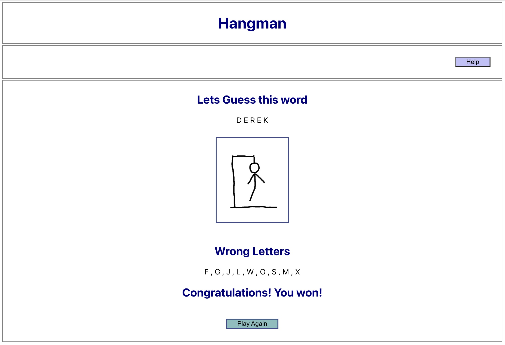

### Hi there 👋
I'm Sana, I'm passionate about web development, this github profile demonstrates my learning journey.

### Specialties: Programming skills in:
- JavaScript, React.js CSS, HTML5, JSON
Other Languages Used
- Java, 
- C++

### 🔭 I’m currently working on
I've enrolled in Hyperian-Dev web development bootcamp, They gave us 52 tasks to learn web development thoroughly. For the final task I made a game of hangman. 

### 🌱 I’m currently learning ...
React.js, Express.js, MongoDB

[Credits](#credits)
This is made by me [SanSha](https://github.com/sanSha2)
